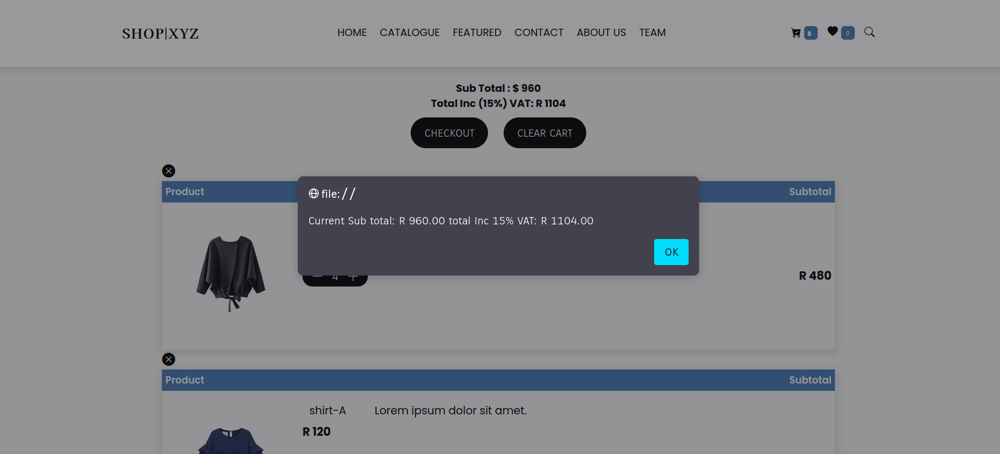

### index

# HyperionDev Full Stack Web Development Bootcamp - Level 1 Task 15 - Capstone project 2 Online-store

> Online store shopping cart project.

---

### Table of Contents

- [Description](#description)
- [How To Use](#how-to-use)
- [References](#references)
- [Author Info](#author-info)

---

## Description

This is a Capstone project for level 1 of the HyperionDev Full Stack Web Development Bootcamp, Building an online store with a fully functional shopping cart that will alert the user how much they are spending every time they add an item to their cart, other features include calculating the total cost, adding VAT and allowing the user to choose from different shipping and discount options and lastly generating a reference number when the user confirms the order.

### Technologies

- HTML 5
- CSS 3
- Javascript
- Bootstrap 5
- jQuery 3.6.0

[Back To The Top](#index)

---

## How To Use

#### Installation

To install clone or download this repository
open homepage.html on the browser of your choice.

### Step 1

On page load you will be directed to the landing page of the website adding items to the cart can be done on three different pages 1.Catalogue page 2.Cart page 3.item details page. For the Catalogue page, Click on the Catalogue link on the navigation bar.

### Step 2

Click the plus button to add items to your cart or the minus button to remove items from your cart.

### Step 3

Total amount changes alert with the sub total and total including 15% VAT

### Step 4

To view item details page click on any item image in the catalogue page or cart page.Add item to your cart.

### Step 5

Total amount changes alert with the sub total and total including 15% VAT

### Step 6

Click on the cart button on the navigation bar from any page on the website to be re directed to the cart page. Where you can see a detailed description of all cart items including the prices and total amounts spent on each item based on the quantity of each item. Below the navbar the sub total and the total including 15% VAT will be displayed.

### Step 7

From this page you can edit your cart items,click the plus button to increase the quantity of an item, click the minus button to lower the quantity per item, click the round x button to to remove an item and all its quantity or click the clear cart button to remove all items in the cart. still receiving total alerts weather adding or removing items from the cart.

### Step 8

Total amount changes alert with the sub total and total including 15% VAT

### Step 9

Checkout page fill out all form inputs and choose from shipping and discount options, click submit to confirm the order.

### Step 10

Finally receive an alert with a generated reference number and the total amount including 15% VAT.

[Back To The Top](#index)

---

## References

- Website - [HyperionDev](https://www.hyperiondev.com/)

---

## Author Info

- Linkedin - [Gauta Ncholo](https://www.linkedin.com/in/gauta-ncholo/)

- Facebook - [@gautancholo](https://www.facebook.com/gauta.ncholo)

[Back To The Top](#index)
